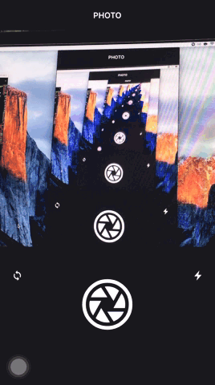

[](http://appcelerator.com/titanium/)
[](http://appcelerator.com/alloy/)
[](http://choosealicense.com/licenses/apache-2.0/)

## ts.camera
Uniform wrapper for iOS [com.mfogg.squarecamera](https://github.com/mikefogg/SquareCamera) and Android [pw.custom.androidcamera](https://github.com/brownemint/Ti-Android-CameraView) modules. All icons are provided by [Ionicons](https://github.com/driftyco/ionicons) font; Refer to their documentation to find which icon is available.

## Previews 



## How to use

**tiapp.xml**
```xml
...
<android xmlns:android="http://schemas.android.com/apk/res/android">
    <manifest>
        <!-- Camera Permissions -->
        <uses-permission android:name="android.permission.CAMERA"/>
        <uses-feature android:name="android.hardware.camera"/>
        <uses-feature android:name="android.hardware.camera.autofocus"/>
    </manifest>
</android>
...
```

**index.xml**

```xml

<Alloy>
    <Window id="container">
        <Widget id="camera" src="ts.camera" onPictureTaken="onPictureTaken" />
    </Window>
</Alloy>


```

**index.tss**
```javascript
"#camera": { // styles for the camera
    top: 64,
    width: '100%', // default value is the width of the screen
    height: '100%' // default value is the same value of the width
},
```

**index.js**
```javascript
function onPictureTaken(e) {
    console.log(e.image); // the taken photo
}
```

## Methods
Both platforms share the same API:

| Function     | Parameters | Usage |
| ----------   | ---------- | ----- |
| snapPicture  |            | Take a photo |
| switchCamera |            | Switch the camera `front` or `back` |
| switchFlash  |            | Turn on or off the flashlight |

## Events
| Event        | Usage |
| ----------   | ----- |
| pictureTaken | Will fire when a picture is taken |

## Changelog
* 1.0
  * Initial version

[](http://wearesmiths.com)
